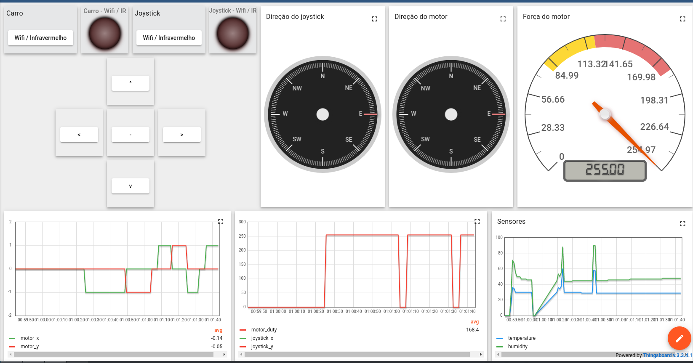

# Tabalho Final - Carrinho de Controle Remoto -  Fundamentos de Sistemas Embarcados 2022/2 

|Matrícula | Aluno |
| :--: | :--: |
| 190012307 |  Eduardo Afonso |
| 190048221 |  Rodrigo Balbino |
| 190020377 |  Thiago Paiva |

## 1. Objetivos
Este trabalho tem por objetivo a implementação de um sistema (que simula) o um carrinho de controle remoto, podento controlá-lo por um joystick por infravermelho ou pela dashboard.

## 2. Ambiente

| Placa | Responsabilidade      | Componentes                                       |
| :--:  | :-------------------: | :---------------------------------------------:   |
| esp32 |  Controle do carrinho | DHT11, Led RGB, H Bridge, Motors e IR receiver    |
| esp32 |  Controle do joystick | Joystick, IR emissor e Led RGB                    |

## 2. Interface

## 3. Apresentação

